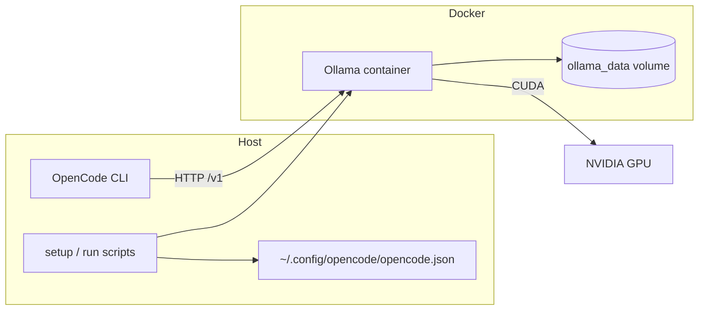
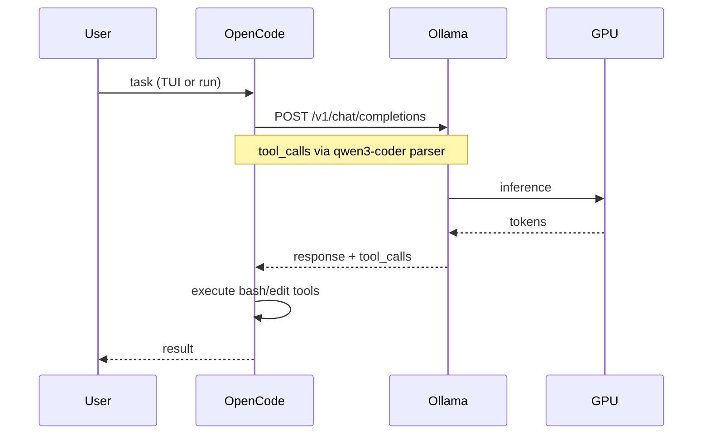

# Architecture

Local stack: Docker runs Ollama with full GPU offload; OpenCode on the host talks to Ollama over the OpenAI-compatible API at `localhost:11434/v1`.

## Component diagram

## Request flow

## File roles

| File | Role |
|------|------|
| `docker-compose.yml` | Ollama service (pinned image), GPU env, 64k context, KV cache tuning |
| `opencode.json` | Template copied to `~/.config/opencode/opencode.json` |
| `Modelfile.*` | Custom model layers (context, system prompt, renderer/parser) |
| `setup-and-start.sh` | Docker compose up, print next steps |
| `setup-model.sh` | Pull base weights, `ollama create` custom models |
| `setup-opencode.sh` | Install OpenCode, sync config and model ID |
| `opencode.sh` | Interactive launcher with long bash timeouts |
| `run-opencode.sh` | Non-interactive `opencode run --auto` with TTY shim |
| `scripts/install.sh` | Clone to `/opt/opencode-3090ti`, enable systemd + 6h updater |
| `scripts/update.sh` | `git pull` + `docker compose pull/up` (timer + manual) |
| `scripts/test-all.sh` | Full suite: lint + static + smoke + coverage gate + Ollama startup |
| `scripts/lint-all.sh` | shellcheck, actionlint, YAML/JSON/Modelfile/systemd lint |
| `scripts/test-coverage.sh` | 100% file inventory gate (every tracked file must have lint+test owners) |
| `docker-compose.ci.yml` | Non-GPU compose overlay for CI startup tests |

## GPU memory budget (default 30B)

Tuned for 24 GB (RTX 3090 Ti):

- `OLLAMA_NUM_GPU=999` — offload all layers to GPU
- `OLLAMA_KV_CACHE_TYPE=q8_0` — quantize KV cache
- `OLLAMA_CONTEXT_LENGTH=65536` — 64k token window
- `num_ctx 65536` in Modelfile — per-request context

## Model variants

| Custom model | Base | Tool calling | Notes |
|--------------|------|--------------|-------|
| `qwen3-coder-30b-opencode` | `qwen3-coder:30b` | Native (`qwen3-coder` renderer/parser) | Default |
| `qwen3-8b-opencode` | `qwen3:8b` | Native | Lower VRAM |
| `llama3.2-opencode` | `llama3.2:latest` | Native | Fast interim fallback |
| `qwen2.5-coder-14b` (Modelfile only) | `qwen2.5-coder:14b` | Content JSON only | Not compatible with OpenCode tools |

## Related

- [Ollama Docker stack](features/ollama-docker.md)
- [Auto-updates](features/auto-updates.md)
- [Model setup](features/model-setup.md)
- [OpenCode configuration](features/opencode-config.md)
